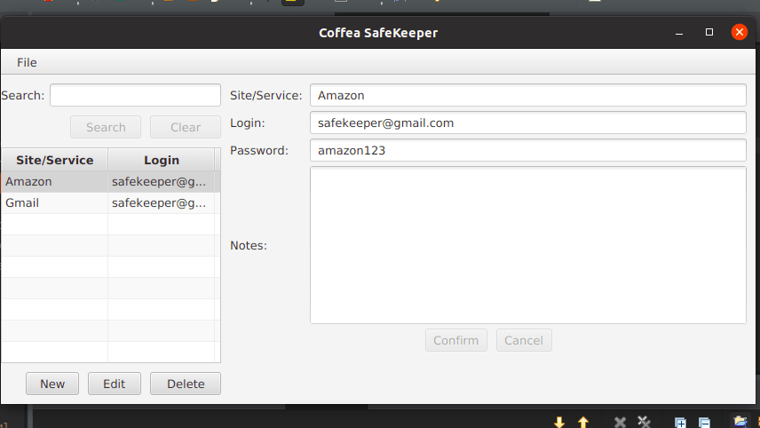

# SafeKeeper
This is an example of an app that will store your passwords securely. Connects to the MySQL database, so perform the following steps:

CREATE DATABASE SAFEKEEPER;

CREATE TABLE SERVICE_PASSWORD (
ID INT NOT NULL AUTO_INCREMENT,
LOGIN VARCHAR(45) NOT NULL,
PASSWORD VARCHAR(50) NOT NULL,
SERVICE VARCHAR(45) NOT NULL,
NOTES VARCHAR(200),
PRIMARY KEY(ID));

That way it will be possible to store your passwords in the database. This application is simple, highly recommended for studies and consultations.
Thank you.

**IMAGES**

## Bio
# Willian Carrijo

:coffee: Apaixonado por programação. Atualmente estudando Java, pretendo trabalhar na área.
Buscando colaborar em outros projetos, pronto para novos desafios.

:email: &nbsp; Entre em contato comigo:  
|

